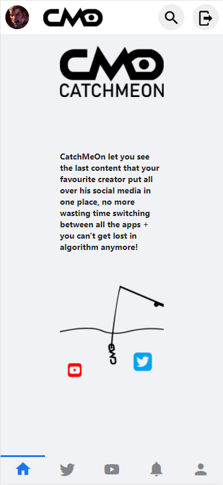
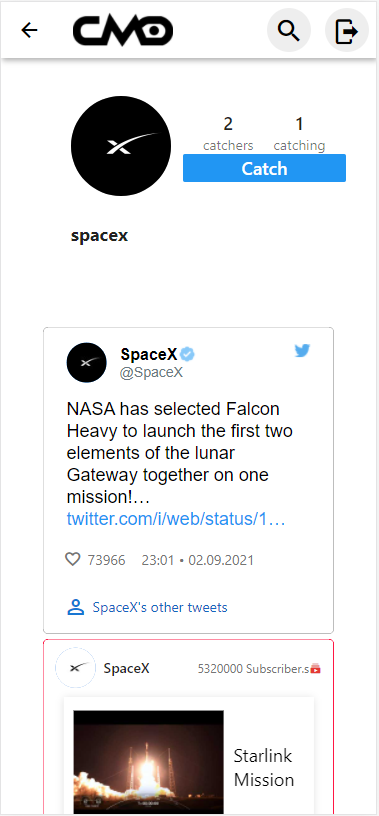

# PLATINE 2020-2021 Project  : CatchMeOn

 CatchMeOn it's an  application who regroup different social network (for the moment only youtube and twitter are integrated) under one platform,
 it allows  users  to catch the latest contents of their favorite content creators with one click.

## Screenshots

Home Screen Page  | Twitter Screen Page | Profile Scree Page
--- | --- | ---
|  |  

## how to run:

This project is a Flutter application who is connected with Spring api:

#### Setup flutter  [Catchmeon0/web](https://github.com/Catchmeon0/web)  :
  *  in intellij make sure you have the flutter and dart plugins added to the IDE.
  *  add  `key.dart`file in `web/lib/utilities/` that contain `const String API_YOUTUBE_KEY=your_youtube_api_key;`.
  *  add in  `web/web/index.html`  your  Firebase Configuration  script.
  *  in terminal  : `flutter pub get`  then `flutter config --enable-web` .
#### setup API [Catchmeon0/catchmeon-jwt](https://github.com/Catchmeon0/catchmeon-jwt) :
  * create a firebase project, download firebase configuration file as json.
  * put the json file on the root.
  * in `catchmeon-jwt/src/main/java/com/catchmeon/catchmeonjwt/services/FirebaseInisialize.java` put the name of your json who contain  your fireBase configuration  : `FileInputStream serviceAccount = new FileInputStream("./name_of_file_firebase_configuration.json");`
  * add java class `key` who will contain  :
`public class key {
    public final static String authKeyTwitter = "Bearer "+ YouBearerKeyHere }`  
  do not forget the space between the "Bearer", and the bearer key.
    
#### run : 
* run Catchmeon0/catchmeon-jwt
* And run Catchmeon0/web  the device will automatically pop out. (To run with terminal : `flutter run`)

### Authors:
* Mohammed ARBAOUI E-services students at Lille University.
* Abderrahmane ARBAOUI   E-services students at Lille University.

